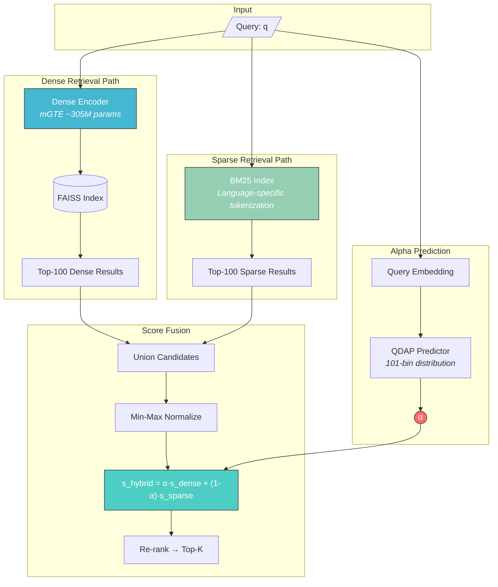
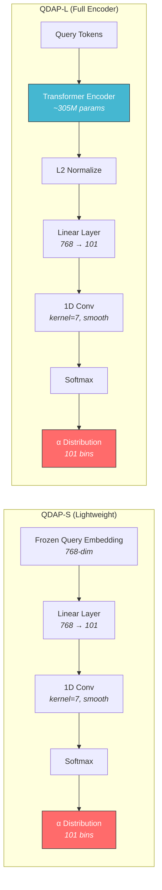
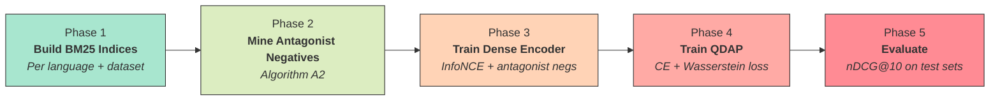
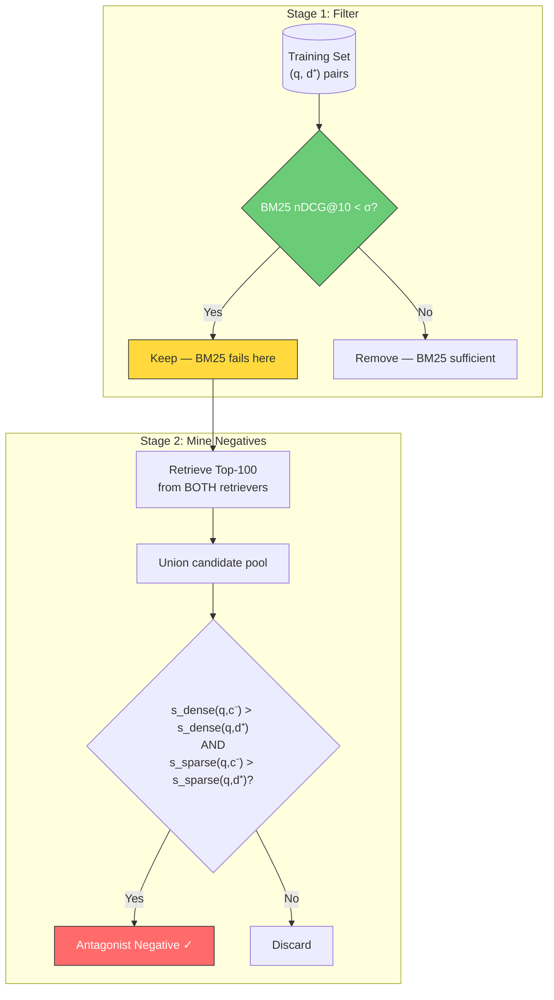
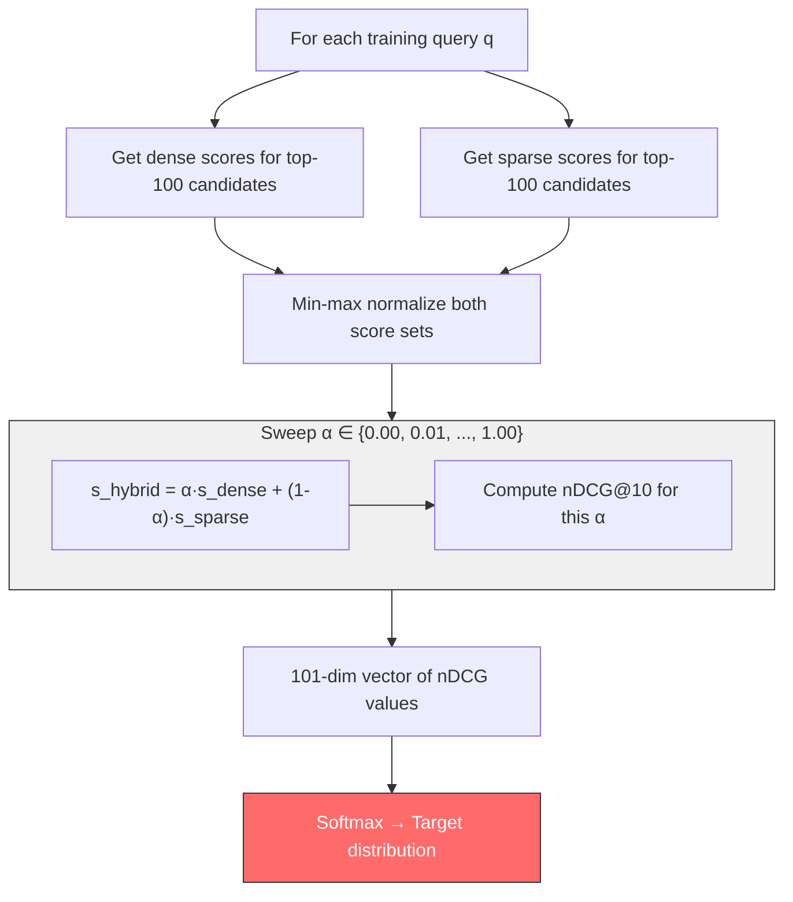
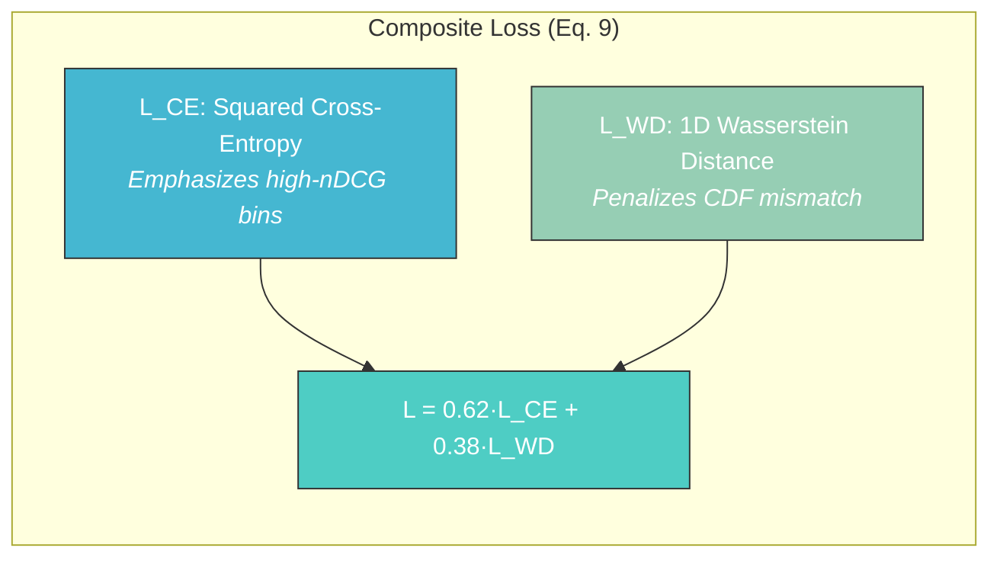
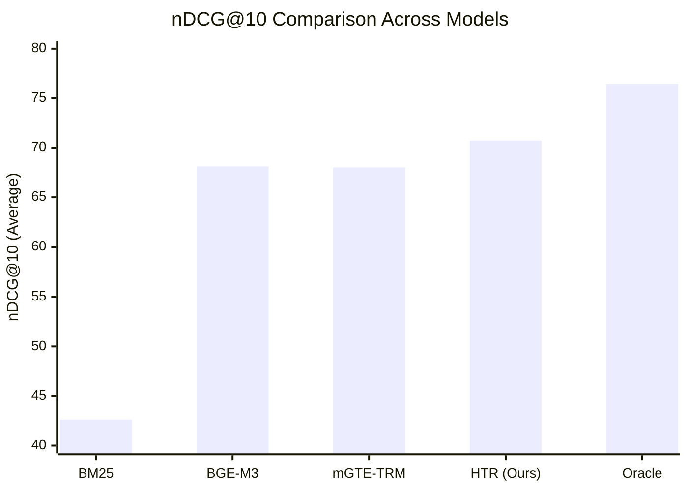
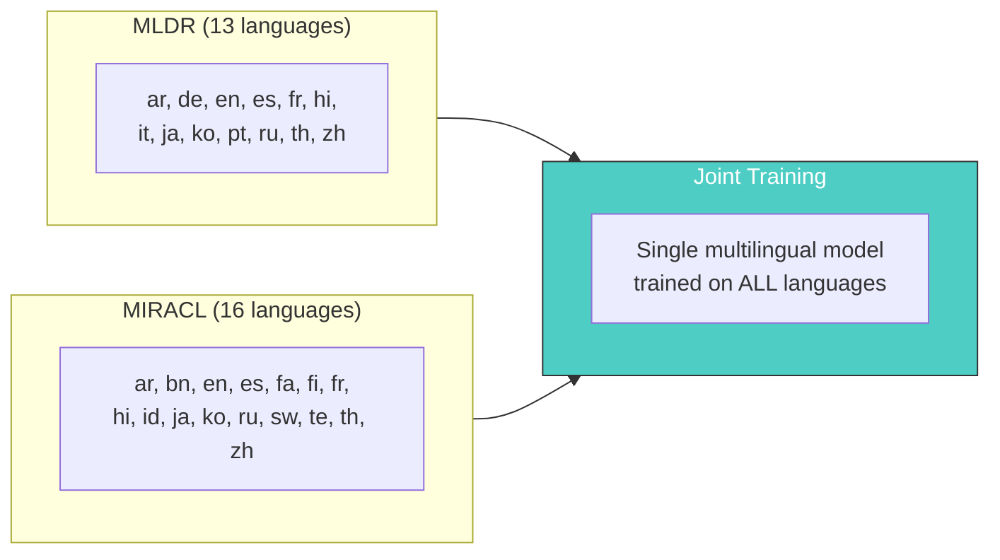
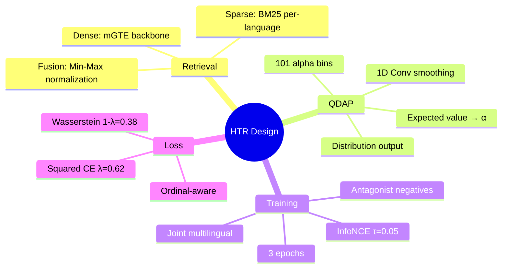

<div align="center">

# Query-Adaptive Hybrid Search

**Dynamically balancing sparse and dense retrieval on a per-query basis**

[](https://doi.org/10.3390/make8040091)
[](https://doi.org/10.3390/make8040091)
[](https://python.org)
[](https://pytorch.org)
[](#license)

<br>

**Topics**

[](https://github.com/topics/information-retrieval)
[](https://github.com/topics/hybrid-search)
[](https://github.com/topics/semantic-search)
[](https://github.com/topics/bm25)
[](https://github.com/topics/dense-retrieval)
[](https://github.com/topics/multilingual-nlp)
[](https://github.com/topics/transformers)
[](https://github.com/topics/contrastive-learning)
[](https://github.com/topics/miracl)
[](https://github.com/topics/mteb)
[](https://github.com/topics/retrieval-augmented-generation)
[](https://github.com/topics/research-code)

<br>

*Implementation of "Query-Adaptive Hybrid Search" (Posokhov et al., 2026)*
*Machine Learning and Knowledge Extraction*

</div>

---

## GitHub About (for discoverability)

Paste this into your repo **About** sidebar (Settings → General, or the ⚙️ on the repo homepage):

| Field | Value |
|:---|:---|
| **Description** | Adaptive hybrid retrieval: per-query BM25 + dense fusion via QDAP. PyTorch implementation with antagonist negative sampling on MLDR & MIRACL (29 languages). |
| **Website** | [Paper (DOI)](https://doi.org/10.3390/make8040091) |
| **Topics** | See [`.github/TOPICS.txt`](.github/TOPICS.txt) |

**One-command setup** (requires [GitHub CLI](https://cli.github.com/) after `gh auth login`):

```powershell
# Windows
.\.github\setup-github-about.ps1
```

```bash
# macOS / Linux
bash .github/setup-github-about.sh
```

<details>
<summary><b>All 20 GitHub topics (click to copy)</b></summary>

```
information-retrieval, hybrid-search, semantic-search, bm25, dense-retrieval,
neural-information-retrieval, multilingual-nlp, pytorch, transformers,
contrastive-learning, question-answering, natural-language-processing,
machine-learning, deep-learning, miracl, mteb, retrieval-augmented-generation,
search-engine, research-code, make-2026
```

</details>

---

## Overview

Traditional hybrid search uses a **fixed mixing weight** to combine BM25 and dense retrieval scores. This fails because different queries benefit from different balances — keyword-heavy queries favor BM25, while semantic queries favor neural retrieval.

**This work introduces two key innovations:**

| Contribution | Description |
|:---|:---|
| **QDAP** (Query-Driven Alpha Prediction) | A neural module that predicts the optimal mixing coefficient α from the query alone |
| **Antagonist Negative Sampling** | A training strategy mining hard negatives where *both* retrievers fail, forcing complementary learning |

---

## Architecture

### System Overview



### QDAP Architecture (Two Variants)



> **Key Insight:** QDAP predicts a *distribution* over 101 alpha values [0.00, 0.01, ..., 1.00], not a single point estimate. The 1D convolution smooths adjacent bins, and the expected value gives the final α.

---

## Training Pipeline

### End-to-End Training Phases



### Antagonist Negative Sampling (Algorithm A2)



> **Intuition:** Antagonist negatives are documents that *both* retrievers incorrectly rank above the true positive. Training on these forces the dense encoder to learn complementary signals that BM25 misses.

### QDAP Target Construction (Algorithm A1)



---

## Loss Function

The QDAP predictor is trained with a composite loss combining cross-entropy and Wasserstein distance:



| Component | Formula | Purpose |
|:---|:---|:---|
| **Squared CE** | `-Σ (ŷ²/‖ŷ²‖₁) · log(p)` | Sharpens target, focuses on optimal α region |
| **Wasserstein** | `Σ \|CDF(p) - CDF(ŷ)\|` | Respects ordinal structure of alpha bins |
| **λ weight** | `0.62` | Empirically selected balance |

---

## Results

### Main Results (nDCG@10)

| Model | MLDR | MIRACL | **Average** |
|:---|:---:|:---:|:---:|
| BM25 baseline | 53.6 | 31.7 | 42.6 |
| BGE-M3 (Dense+Sparse+Multi-vec) | 65.0 | 71.2 | 68.1 |
| mGTE-TRM (Dense+Sparse) | 71.3 | 64.7 | 68.0 |
| **HTR (Ours)** | **74.3** | **67.1** | **70.7** |
| HTR Oracle (upper bound) | 79.1 | 73.8 | 76.4 |

### Performance Comparison



### Multilingual Coverage



---

## Installation

```bash
# Clone the repository
git clone https://github.com/your-username/query-adaptive-hybrid-search.git
cd query-adaptive-hybrid-search

# Install dependencies
pip install -e .

# (Optional) GPU support with FAISS-GPU
pip install faiss-gpu

# (Optional) Experiment tracking
pip install wandb
```

### Requirements

- Python 3.9+
- PyTorch 2.0+
- Transformers 4.36+
- ~16GB GPU memory (for training)
- ~50GB disk space (for datasets)

---

## Usage

### Full Pipeline

```bash
# Phase 1: Download datasets
python scripts/download_data.py --datasets mldr miracl --languages all

# Phase 2: Build BM25 indices (language-specific tokenization)
python scripts/build_bm25_index.py --datasets mldr miracl --languages all

# Phase 3: Mine antagonist negatives (offline, before training)
python scripts/mine_antagonist_negatives.py \
    --base_model "Alibaba-NLP/gte-multilingual-base" \
    --threshold_sigma 0.5 \
    --top_k 100

# Phase 4: Train dense encoder (3 epochs, InfoNCE + antagonist negatives)
python scripts/train.py --stage dense \
    --config configs/train_dense.yaml

# Phase 5: Train QDAP predictor (composite CE + Wasserstein loss)
python scripts/train.py --stage qdap \
    --config configs/train_qdap.yaml

# Phase 6: Evaluate (nDCG@10, oracle, optimal baselines)
python scripts/evaluate.py --config configs/eval.yaml
```

### Inference Example

```python
from src.models import DenseEncoder, QDAP_L, HybridRetriever
from src.data import BM25Index

# Load models
dense = DenseEncoder("Alibaba-NLP/gte-multilingual-base")
qdap = QDAP_L.from_dense_encoder("checkpoints/dense_encoder/best.pt")
bm25 = BM25Index.load("data/bm25_indices/miracl/en.pkl")

# Create hybrid retriever
retriever = HybridRetriever(dense, bm25, qdap, fusion="minmax")

# Search — alpha is automatically predicted per-query
results = retriever.search("What causes northern lights?", top_k=10)
for doc_id, score in results:
    print(f"  {doc_id}: {score:.4f}")
```

---

## Project Structure

```
├── configs/
│   ├── train_dense.yaml          # Dense encoder training config
│   ├── train_qdap.yaml           # QDAP predictor training config
│   └── eval.yaml                 # Evaluation config
├── src/
│   ├── models/
│   │   ├── dense_encoder.py      # mGTE-based dual encoder (768-dim, RoPE)
│   │   ├── qdap_s.py             # QDAP-S: lightweight adapter (~1M params)
│   │   ├── qdap_l.py             # QDAP-L: full encoder (~305M params)
│   │   └── hybrid_retriever.py   # End-to-end hybrid retrieval pipeline
│   ├── data/
│   │   ├── dataset_loader.py     # MLDR + MIRACL from HuggingFace
│   │   ├── antagonist_sampler.py # Algorithm A2: antagonist negative mining
│   │   └── bm25_index.py         # BM25 with trigram tokenization for CJK+
│   ├── training/
│   │   ├── train_dense.py        # InfoNCE training with antagonist negatives
│   │   ├── train_qdap.py         # QDAP training (Algorithm A1)
│   │   └── losses.py             # InfoNCE, Squared CE, Wasserstein, Composite
│   ├── evaluation/
│   │   ├── metrics.py            # nDCG@10 computation
│   │   ├── evaluate.py           # Full evaluation pipeline
│   │   └── oracle.py             # Oracle + optimal-α upper bounds
│   └── utils/
│       ├── score_normalization.py # Min-max, RRF, hybrid fusion
│       └── tokenizers.py         # Language-specific + trigram tokenizers
├── scripts/
│   ├── download_data.py          # Dataset download
│   ├── build_bm25_index.py       # BM25 index construction
│   ├── mine_antagonist_negatives.py  # Hard negative mining
│   ├── train.py                  # Training entry point
│   └── evaluate.py               # Evaluation entry point
├── tests/
│   ├── test_losses.py            # Loss function tests
│   ├── test_qdap.py              # QDAP model tests
│   └── test_normalization.py     # Score normalization tests
├── requirements.txt
├── setup.py
└── README.md
```

---

## Key Design Decisions



---

## Hyperparameters

| Parameter | Value | Source |
|:---|:---:|:---|
| Embedding dimension | 768 | Section 4.1 |
| Dense encoder params | ~305M | Section 4.1 |
| QDAP bins | 101 | α ∈ {0.00, 0.01, ..., 1.00} |
| QDAP conv kernel | 7 | Section 3.3 |
| Loss λ (CE weight) | 0.62 | Section 3.3 |
| BM25 k₁ / b (MIRACL) | 0.9 / 0.4 | Section 3.2 |
| BM25 k₁ / b (MLDR) | 1.2 / 0.75 | Section 3.2 |
| RRF k | 60 | Section 3.2 |
| Candidate pool size | 100 | Section 3.2 |
| InfoNCE temperature τ | 0.05 | Standard |
| Training epochs | 3 | Figures 6–7 |
| Random seeds | 10 | Section 4 |

---

## Citation

```bibtex
@article{posokhov2026query,
  title={Query-Adaptive Hybrid Search},
  author={Posokhov, Pavel and others},
  journal={Machine Learning and Knowledge Extraction},
  volume={8},
  number={4},
  pages={91},
  year={2026},
  publisher={MDPI},
  doi={10.3390/make8040091}
}
```

---

## License

This implementation is for **research purposes only**. Please cite the original paper if you use this code in your work.

---

<div align="center">
<i>Built with PyTorch and Transformers</i>
</div>
