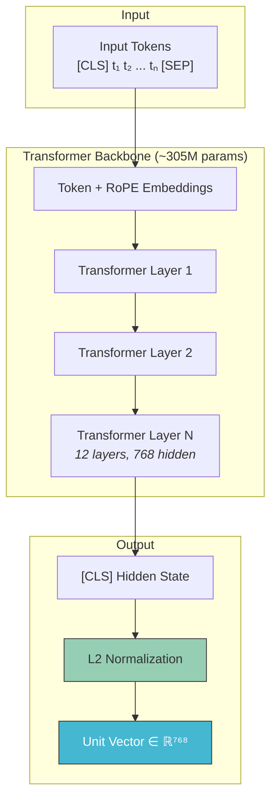
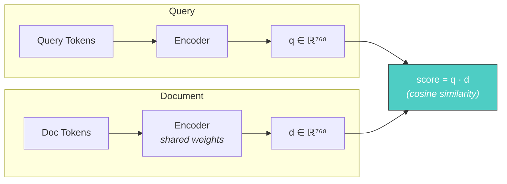
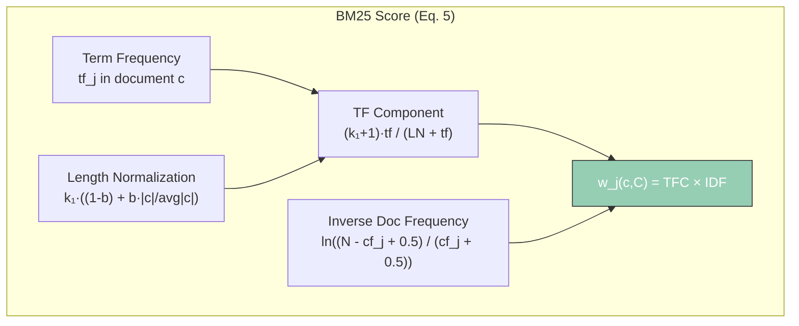
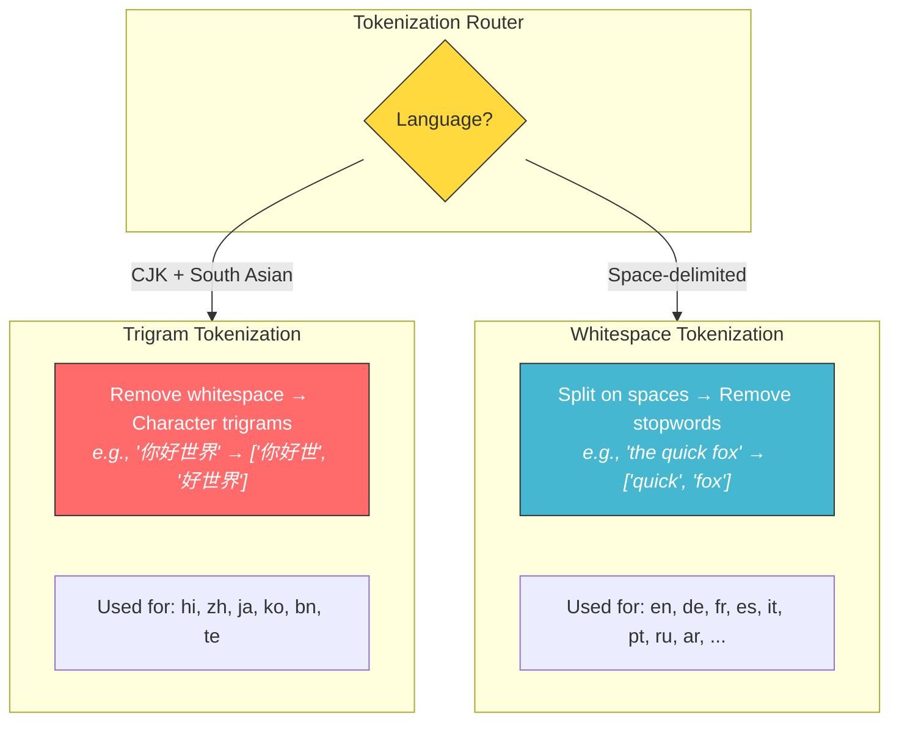
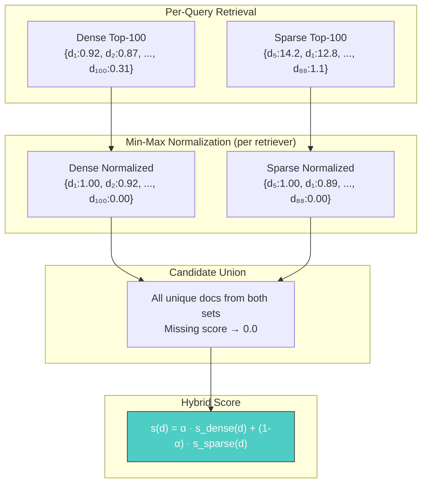
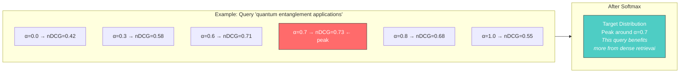
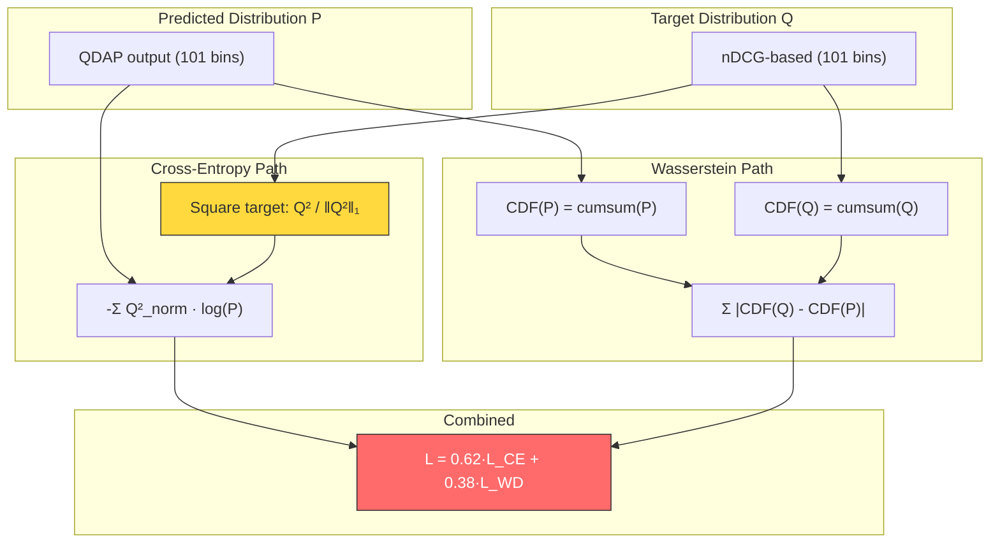
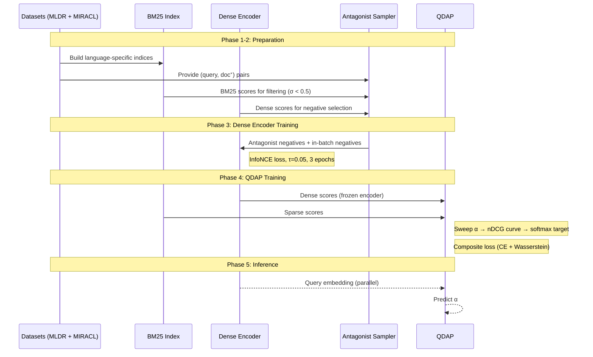
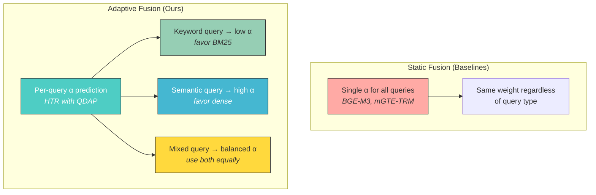

# Architecture Deep Dive

Detailed technical diagrams for the Query-Adaptive Hybrid Search system.

---

## 1. Dense Encoder Architecture

### Dual-Encoder Scoring

---

## 2. BM25 Scoring Formula

### Language-Specific Tokenization Strategy

---

## 3. Score Normalization and Fusion

---

## 4. QDAP Training Target Distribution

---

## 5. Composite Loss Visualization

---

## 6. Full Training Data Flow

---

## 7. Comparison with Baselines

