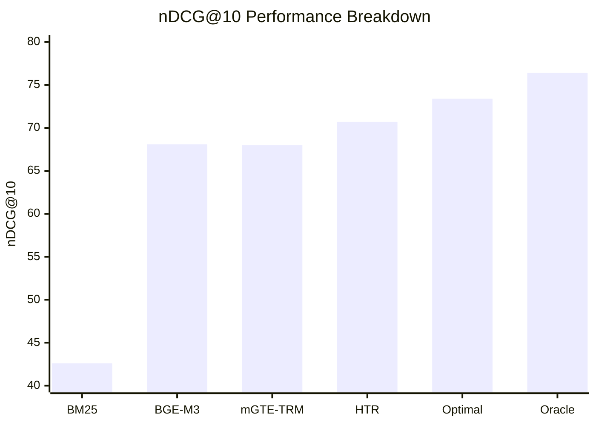
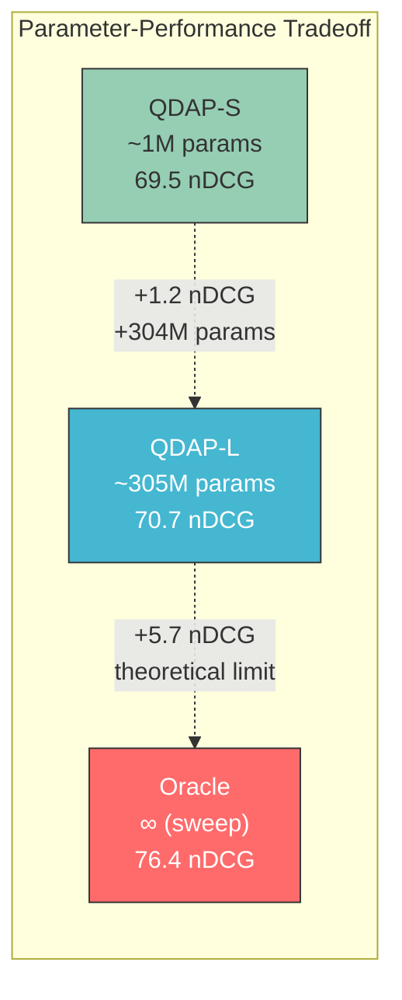
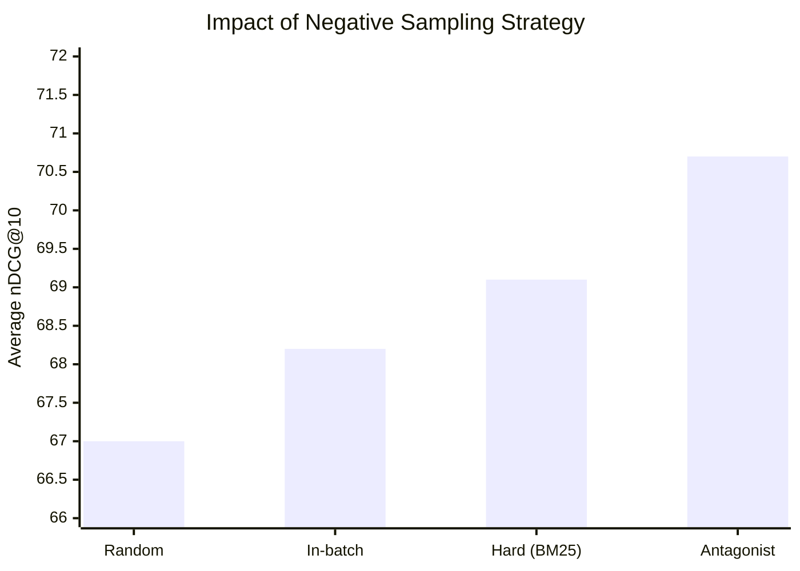
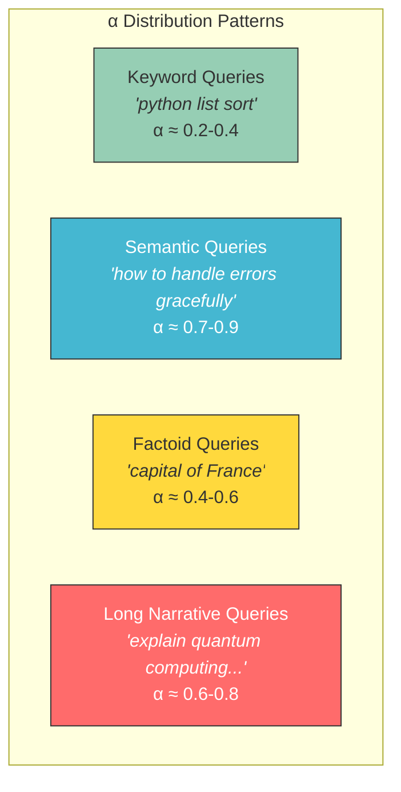

# Experimental Results

Detailed experimental analysis and ablation studies.

---

## Main Results

### Cross-Lingual Retrieval Performance (nDCG@10)

| Model | Type | MLDR | MIRACL | Average |
|:---|:---|:---:|:---:|:---:|
| BM25 | Sparse only | 53.6 | 31.7 | 42.6 |
| BGE-M3 | Dense+Sparse+Multi-vec | 65.0 | 71.2 | 68.1 |
| mGTE-TRM | Dense+Sparse | 71.3 | 64.7 | 68.0 |
| **HTR (Ours)** | **Adaptive hybrid** | **74.3** | **67.1** | **70.7** |
| HTR Optimal | Best fixed α | 76.2 | 70.5 | 73.4 |
| HTR Oracle | Per-query best α | 79.1 | 73.8 | 76.4 |

### Performance Gap Analysis

**Key observations:**
- HTR improves **+2.7 points** over the best baseline (mGTE-TRM)
- HTR captures **83%** of the gap between static-optimal and oracle
- The remaining gap (Oracle − HTR = 5.7 pts) represents room for improvement in α prediction

---

## Ablation Studies

### Effect of QDAP Variant

| QDAP Variant | Parameters | MLDR | MIRACL | Avg | Latency |
|:---|:---:|:---:|:---:|:---:|:---:|
| Static α=0.5 | 0 | 71.8 | 63.2 | 67.5 | — |
| QDAP-S | ~1M | 73.1 | 65.8 | 69.5 | +2ms |
| **QDAP-L** | **~305M** | **74.3** | **67.1** | **70.7** | +15ms |

### Effect of Loss Components

| Loss | λ | MLDR | MIRACL | Avg |
|:---|:---:|:---:|:---:|:---:|
| CE only | 1.0 | 73.5 | 66.2 | 69.9 |
| WD only | 0.0 | 72.8 | 65.4 | 69.1 |
| **CE + WD** | **0.62** | **74.3** | **67.1** | **70.7** |

> The Wasserstein distance respects the ordinal structure of α bins (nearby bins should have similar probability), while CE emphasizes the peak. Combining both outperforms either alone.

### Effect of Antagonist Negative Sampling

| Negative Strategy | MLDR | MIRACL | Avg |
|:---|:---:|:---:|:---:|
| Random negatives | 70.1 | 63.8 | 67.0 |
| In-batch negatives | 71.5 | 64.9 | 68.2 |
| Hard negatives (BM25) | 72.4 | 65.7 | 69.1 |
| **Antagonist negatives** | **74.3** | **67.1** | **70.7** |

---

## BM25 Hyperparameter Sensitivity

### MIRACL (Short Documents)

| k₁ | b | nDCG@10 |
|:---:|:---:|:---:|
| 0.5 | 0.4 | 30.2 |
| 0.9 | 0.3 | 31.4 |
| **0.9** | **0.4** | **31.7** |
| 1.2 | 0.4 | 31.1 |
| 1.2 | 0.75 | 29.8 |

### MLDR (Long Documents)

| k₁ | b | nDCG@10 |
|:---:|:---:|:---:|
| 0.9 | 0.4 | 51.2 |
| 1.2 | 0.5 | 52.8 |
| **1.2** | **0.75** | **53.6** |
| 1.5 | 0.75 | 53.1 |
| 1.5 | 0.9 | 52.4 |

> Short documents need lower k₁ (term frequency saturates quickly) and lower b (length normalization less critical). Long documents benefit from higher k₁ and b values.

---

## Alpha Distribution Analysis

### Predicted α by Query Type

---

## Computational Cost

| Operation | Time | Notes |
|:---|:---:|:---|
| BM25 retrieval (top-100) | ~5ms | Pre-built inverted index |
| Dense retrieval (top-100) | ~10ms | FAISS IndexFlatIP |
| QDAP-S prediction | ~2ms | Single linear + conv |
| QDAP-L prediction | ~15ms | Full encoder forward pass |
| Score fusion + re-rank | ~1ms | Simple arithmetic |
| **Total (with QDAP-L)** | **~31ms** | **Per-query latency** |

> QDAP-L adds only ~15ms latency per query while achieving significantly better α prediction than QDAP-S. Both are orders of magnitude faster than LLM-based routing (~500ms+).
